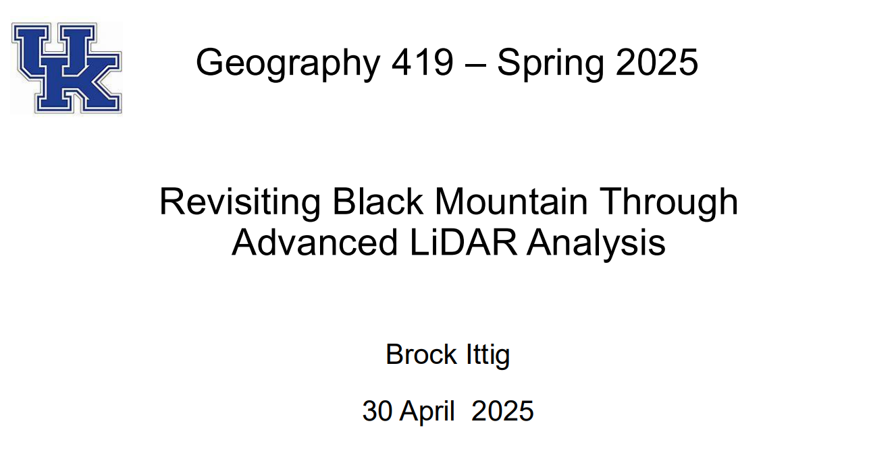
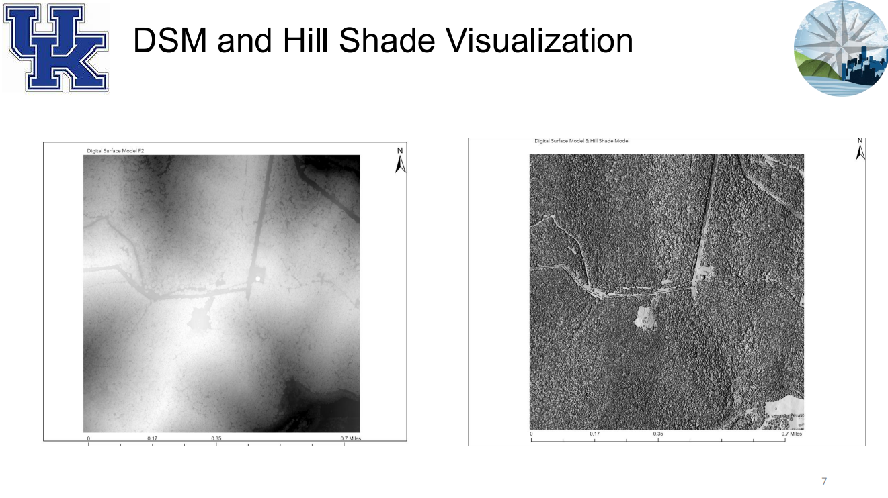

# Revisiting Black Mountain: LiDAR Analysis

## Overview
This project presents an advanced LiDAR-based terrain and elevation analysis of
Black Mountain, Kentucky, one of the highest peaks in the state.

The analysis focuses on extracting detailed terrain characteristics using
LiDAR-derived DEM and DSM products, hillshade visualization, and spatial QA/QC
to support terrain interpretation and emergency response planning.

## Key Skills Demonstrated
- LiDAR-derived DEM & DSM processing
- Terrain and hillshade visualization
- Elevation interpretation and spatial QA/QC
- Raster analysis and geospatial workflows
- Integration of LiDAR data for applied planning use cases

## Project Preview

### LiDAR Terrain & Context Mapping

### Elevation & Surface Visualization

## Full Project Report
📄 **[Download the full PDF report](Revisiting_Black_Mountain_Advanced_LiDAR_Analysis_Ittig.pdf)**

## Tools & Data
- ArcGIS Pro
- ERDAS IMAGINE 2023
- Python
- KyFromAbove LiDAR data

## Notes
This project emphasizes applied LiDAR analysis and visualization techniques
commonly used in terrain assessment, infrastructure planning, and emergency
response contexts.
